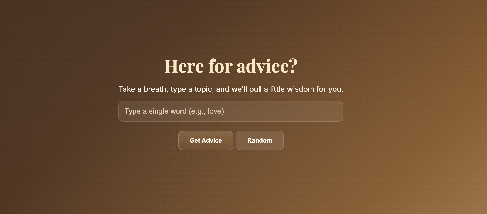

# ☕ Here for Advice — Advice API App

A calm, cozy space where you can type a **topic** or tap **Random** to receive a bit of wisdom from the **Advice Slip API**.  
Built with soft chocolate-nude tones to feel comforting, grounded, and easy on the eyes — like a warm note passed across the table.

[Link to project](replace with your live demo)  

---

## How It’s Made:
**Tech used:** HTML, CSS, JavaScript  

Here for Advice fetches quotes from the Advice Slip API and displays them on a note-style card once you click **Get Advice** or **Random**.  
The interface stays minimal and centered, keeping the focus on the message while blending warm tones and soft gradients for a relaxing atmosphere.

---

## Optimizations
- Add a fade-in transition when advice appears.  
- Include a short loading state or animation between fetches.  
- Let users save favorite advice notes locally.  
- Add a toggle for light/dark or seasonal color themes.  
- Display a timestamp for when each note was received.

---

## Lessons Learned
- A minimal layout can still feel emotionally engaging through color and spacing.  
- Adding small UX touches — like hiding content until it’s ready — makes the experience more intentional.  
- Warm tones and subtle design choices can set the emotional tone of a project.  
- Even the simplest API can inspire thoughtful, finished design.
